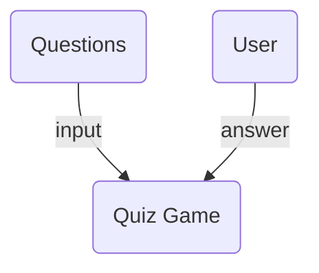

Quiz Game
===

## Introduction
- Quiz Game desktop application developed using C# and XML.
- The user has the ability select a desired complexity level for the quiz.
- Depending on the selected complexity level, the application provides relevant questions with possible response options.
- The user has the ability to select the correct answer for each question.
- At the end, the application summarizes the administered test results and the user has the possibility to take another test.
- The questions and possible answers are stored in XML format. [See the structure of the XML file](https://github.com/ioanabirsan/wpf-questionnaire/blob/master/questions.xml) for more information.

# Architecture 

## Solution
### Technologies
- .NET Framework, C#
- XML

### Package Structure
- `Model`: the model classes for the application representing an Items and Options
- `Resources`: the resources used by the application (XML files that contains the questions)
- `Properties`: properties generated based on the XAML descriptions
- `Service`: service logic that exposes access to available questions
- `View`: the logic for the UI
- `ViewMode`: the business logic

## How to play
1. Download the application executable from the repository: 
   - `Questionnaire.exe` or direct link from here: [Questionnaire](https://github.com/ioanabirsan/wpf-questionnaire/blob/master/Questionnaire.exe?raw=true)
2. Download the list of questions that is used as input for the Quiz Game: 
   - `questions.xml` or direct link from here [Questions](https://raw.githubusercontent.com/ioanabirsan/wpf-questionnaire/master/questions.xml?raw=true)
3. Make sure that `Questionnaire.exe` and `questions.xml` are both residing in the same directory. `Questionnaire.exe` will use the `questions.xml` file as input to populate the list of questions.
4. Start the game by opening `Questionnaire.exe`

Alternatively you can clone the repository using `git clone https://github.com/ioanabirsan/wpf-questionnaire.git` and start the game from the wpf-questionnaire directory using `Questionnaire.exe`.

## Notes
- This will work only under Windows systems
